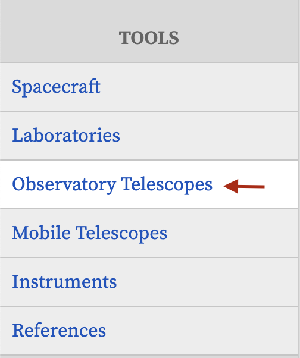
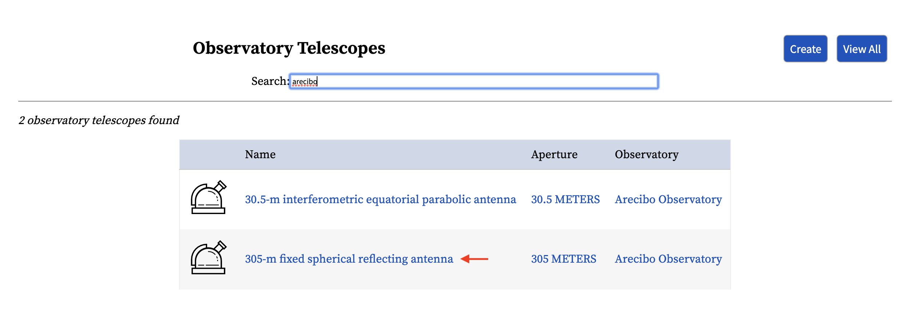
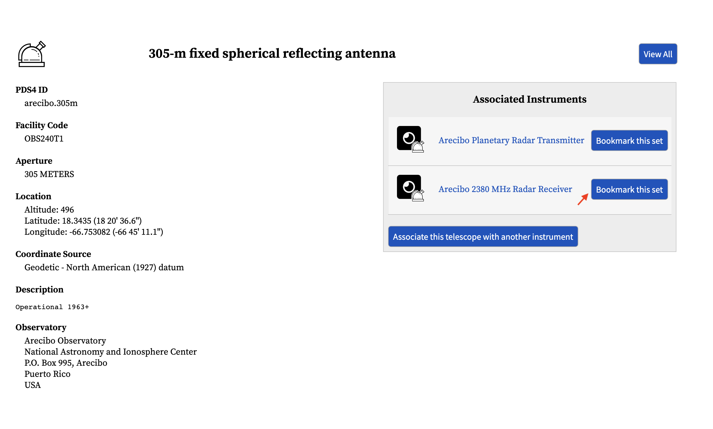
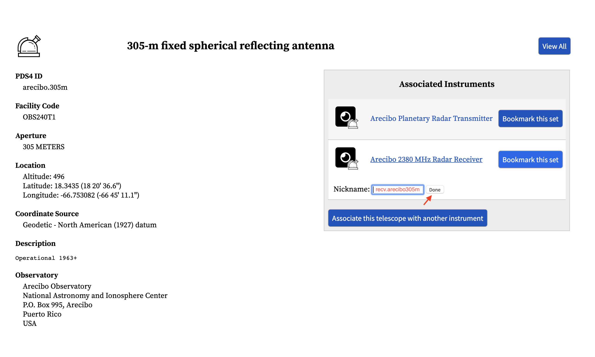
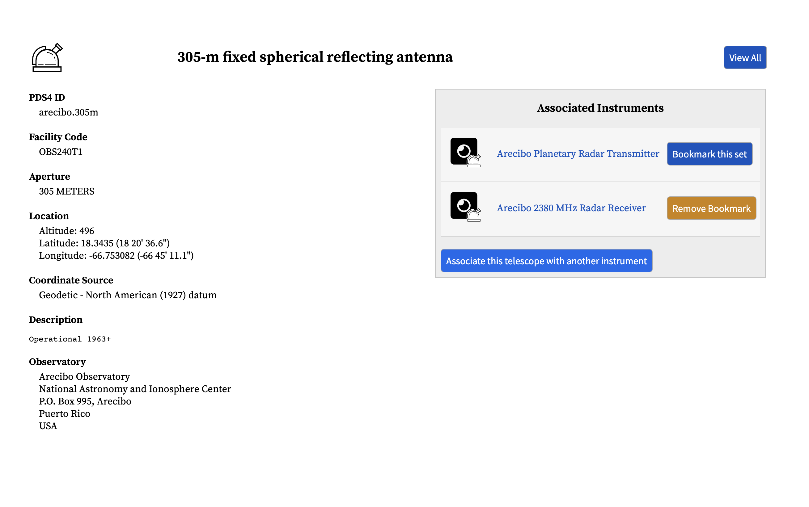
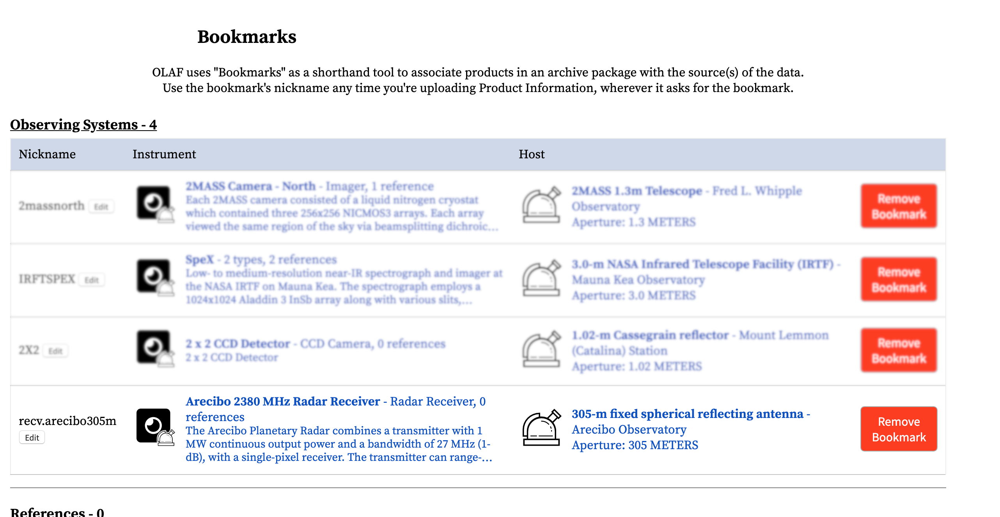

# Creating Observing System Bookmarks

## Overview

An observing system bookmark is a set pair of instrument and facility codes that is easy to re-use and remember. If you decide to use an observing bookmark to reference a set pair of facility/instrument codes, you must exclude the Facility and Instrument keywords from the file.

To create an observing bookmark, use the "Tools" section of the menubar to search for and select a facility or instrument. Selecting a facility or instrument will reveal further details about that item. You will have the option at the bottom of this page to create a bookmark.

To use a bookmark, you must give it a nickname so that you can refer to it in your CSV file. Click on "My Bookmarks" in the menubar. Find the bookmark you wish to use and click the "Edit" button in the "Nickname" column. A nickname can be any simple string you choose and can contain letters, numbers, and spaces.

## Individual Steps

In this example, we will create a bookmark for an observing system using the observatory telescope as the starting point.

### Bringing up the search interface

The observatory search is accessible from the sidebar on the left-hand side of the window.

### Searching for an observatory

When you enter the name of an observatory, a list of matching results will appear below the search box. Click on the one that you want to create a bookmark for.

### Entering a bookmark

In the instrument or observatory details screen, a list of related instruments is available in a sidebar on the right-hand of the window. Click the "Create Bookmark" button for the instrument that you want to create a bookmark for.

You will be asked for the name of your bookmark. Enter a name for the bookmark, and click "Done".

After the bookmark is entered, the "Create Bookmark" button will change to a "Remove Bookmark" button.

### The bookmark page

Your new bookmark will appear in the bookmark page, along with any other bookmarks that you have entered.

